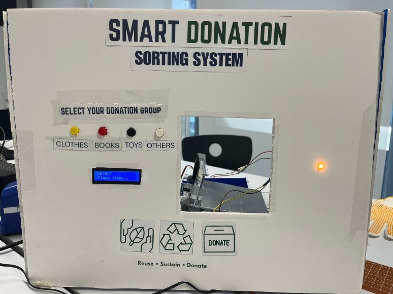
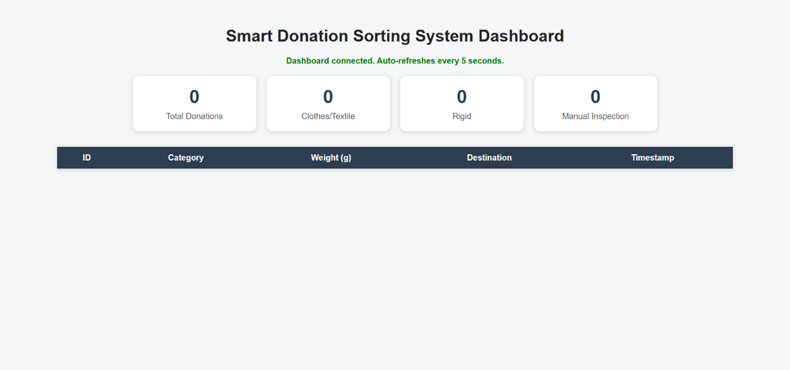
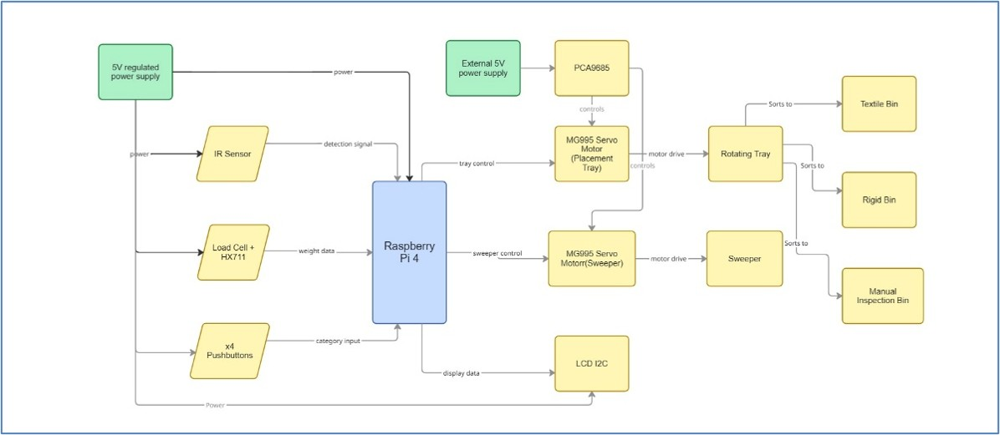
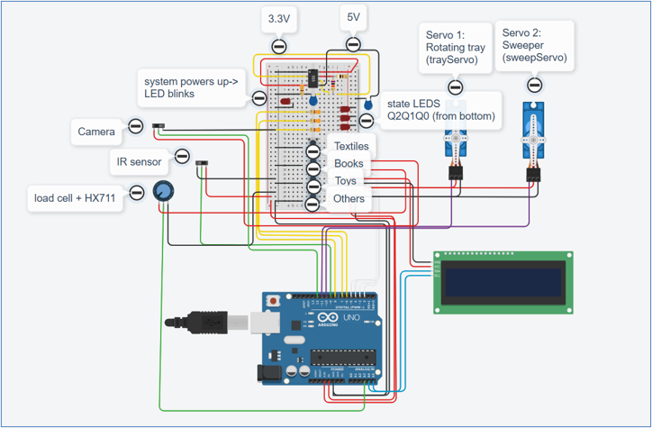

# Smart Donation Sorting System

A Raspberry Pi-based embedded system that automates the initial sorting and inventory tracking of donated items using sensors, servo control, database logging, and a real-time dashboard.

## Overview

This project was completed as part of a university engineering design project in a team of four. The prototype was successfully demonstrated as an IoT-enabled donation sorting system. The project received **2nd Place — Manager’s Choice Award** at the university Innovation Fair.

The Smart Donation Sorting System, also called SDSS, was designed to reduce the manual workload involved in sorting donated items at collection points. The prototype detects an inserted item, measures its weight, accepts user category input, determines the final sorting decision, and routes the item to the correct bin using a servo-driven mechanism.

The system also logs donation records to a MySQL database and displays live donation data on a Flask dashboard.

## Features

- Raspberry Pi 4-based control system
- IR sensor for item detection
- HX711 load cell for weight measurement
- Push-button category selection
- LCD display for user feedback
- LED visual indication
- PCA9685 PWM driver for servo motor control
- Servo-driven rotating tray and sweeper mechanism
- MySQL database logging
- Flask dashboard for live donation tracking
- Finite state machine-based system operation

## Tools and Technologies

- Raspberry Pi 4
- Python
- MySQL
- Flask
- Socket.IO
- HX711 Load Cell Amplifier
- IR Sensor
- PCA9685 PWM Driver
- Servo Motors
- 16x2 LCD Display
- Multisim
- TinkerCAD
- Fusion 360
- Breadboard and perfboard prototyping

## System Operation

1. The user places a donated item into the system.
2. The IR sensor detects the presence of the item.
3. The load cell measures the item weight using the HX711 amplifier.
4. The user selects the item category using push buttons.
5. The Raspberry Pi applies sorting logic.
6. The system determines the final destination: Textile, Rigid, or Manual Inspection.
7. The servo-driven rotating tray moves to the correct bin position.
8. The sweeper mechanism pushes the item into the selected bin.
9. The LCD and LED provide feedback to the user.
10. The donation event is logged to the MySQL database and displayed on the Flask dashboard.

## My Contribution

- Worked on sensor integration, including the IR sensor, load cell, and HX711 module.
- Contributed to GPIO connections, Raspberry Pi testing, and finite state machine logic.
- Helped assemble and test the breadboard and perfboard hardware.
- Worked on servo motor control and system integration.
- Contributed to dashboard/database integration and full system testing.
- Participated in prototype manufacturing, wiring, soldering, and Innovation Fair preparation.

## Project Media

### Final Prototype Front View

### Flask Dashboard

### System Block Diagram

### TinkerCAD Schematic

## Code

The repository includes cleaned Python code for the Raspberry Pi control system and HX711 load-cell calibration.

- `code/main_cleaned.py` — main SDSS control program for GPIO inputs, LCD feedback, weight measurement, servo control, database logging, and sorting logic.
- `code/hx711_calibration.py` — calibration script used to obtain tare and calibration ratio values for the HX711 load cell.

Database credentials and private configuration values have been replaced with placeholders.
